# water-quality-ml
Predicting nitrite levels in water samples using Linear Regression, Random Forest, and Neural Networks. Includes evolutionary optimisation benchmarking with Hill Climber and EA on the McCormick function.

This project was completed as part of a university assignment focused on applied machine learning, data preprocessing, and optimisation methods.

## Why this project matters

This project demonstrates practical machine learning work on noisy environmental data, where real-world signals are weak and data quality issues are common.

- Built a complete regression workflow to predict NITRITE concentrations from correlated nutrient and depth features.
- Compared linear and non-linear models to show when simple models fail and more expressive models are needed.
- Applied robust preprocessing (outlier analysis, capping, scaling, depth handling) before model training.
- Used cross-validation for more reliable performance estimates.
- Added an optimisation module (Hill Climber vs Evolutionary Algorithm) to compare search strategies on a standard benchmark function.

## Employer-facing skills demonstrated

- End-to-end ML pipeline thinking: EDA, preprocessing, modelling, evaluation, and interpretation.
- Data quality engineering: outlier diagnostics and controlled capping strategy.
- Scientific communication: notebook narrative explains both what was done and why.
- Experimental design: model comparison under the same prepared dataset and validation approach.
- Reproducibility: environment and dependency instructions for quick onboarding.

## Technical approach

### Part 1: Water quality prediction

- Dataset includes nutrient measures and depth metadata from real sampling conditions.
- Exploratory analysis investigates:
	- feature distributions (including skew/bimodality)
	- pairwise relationships and correlation structure
	- outlier behaviour, especially for NITRITE and AMMONIA
- Feature engineering/preparation includes:
	- outlier capping pipeline
	- depth representation choices
	- scaling for model stability where required
- Models compared:
	- Linear Regression
	- Random Forest Regressor
	- Neural Network (MLP)
- Evaluation includes train/test metrics and k-fold cross-validation checks.

#### Visual evidence for Part 1

Raw data exploration

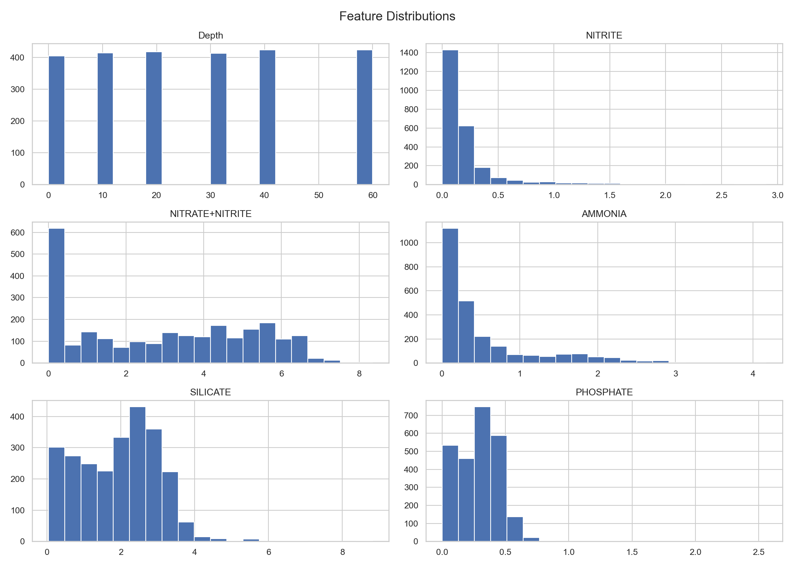
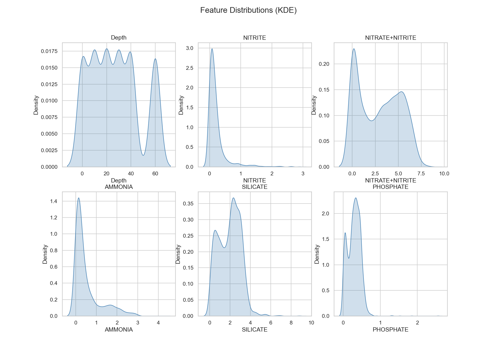
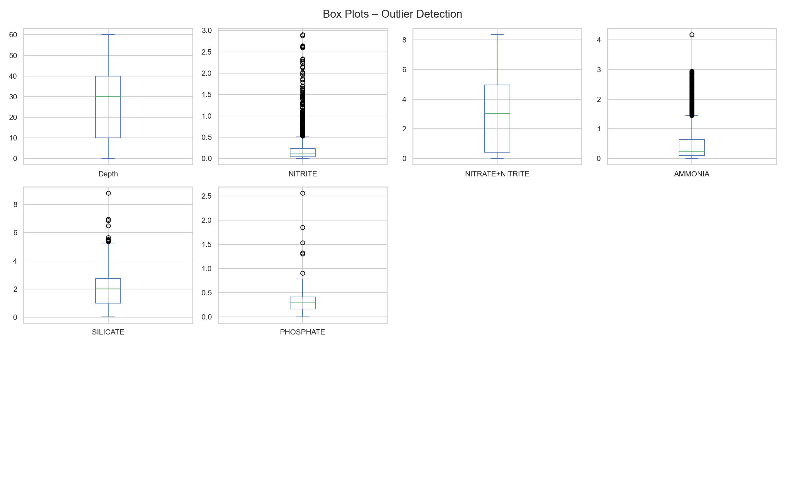
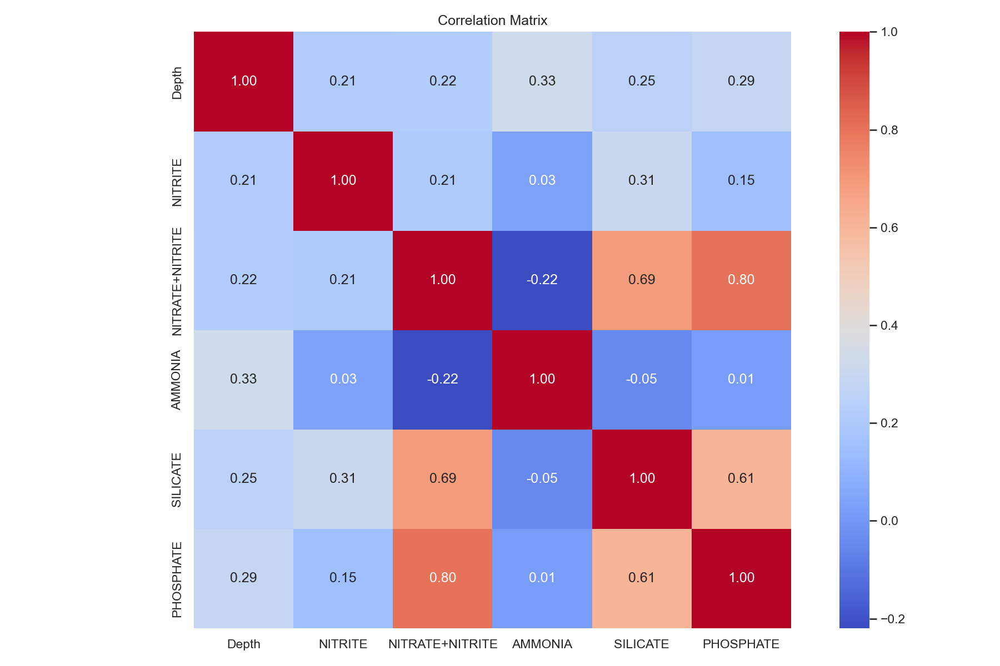
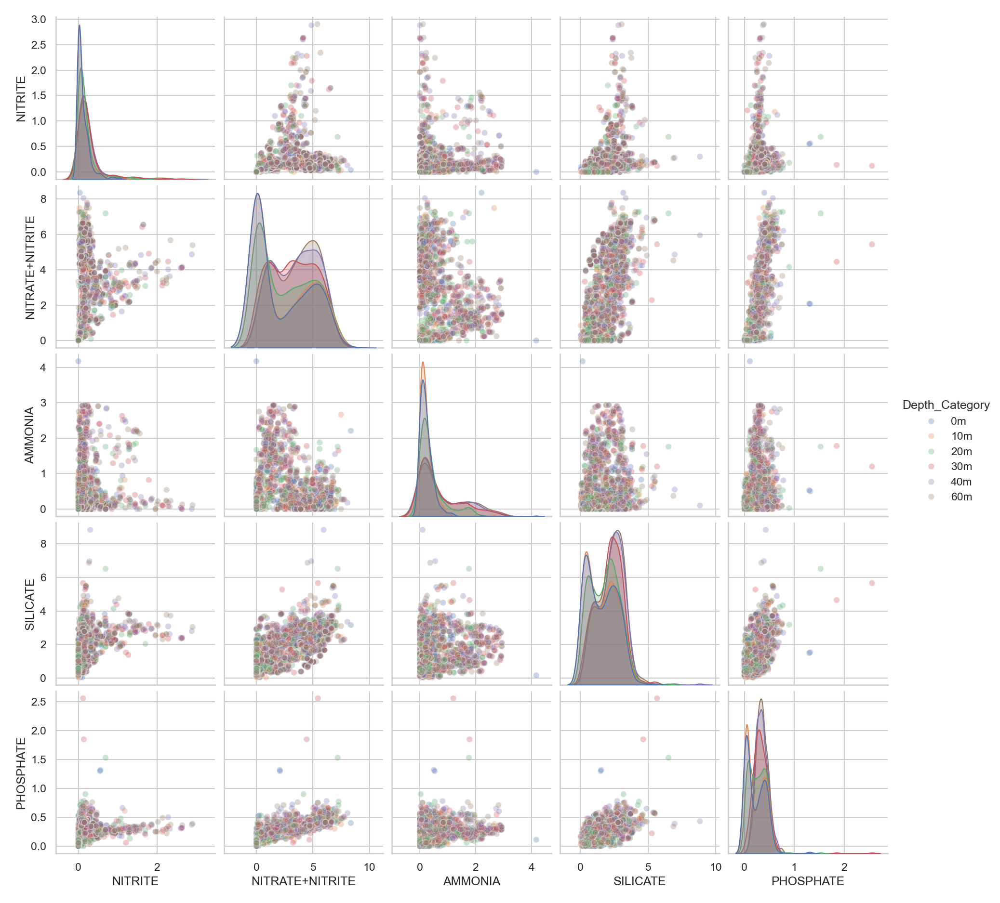

After capping and cleaning
The figures below are deliberate before-vs-after comparisons created to show the direct impact of outlier capping as part of the assignment workflow.

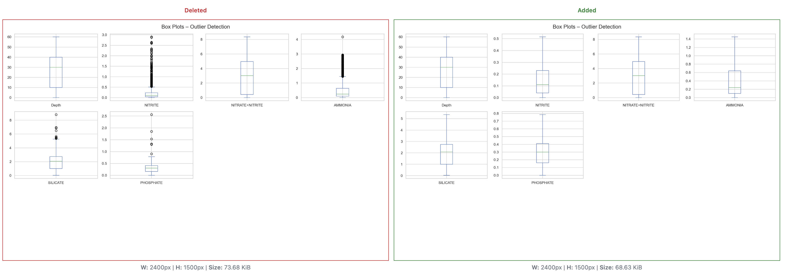
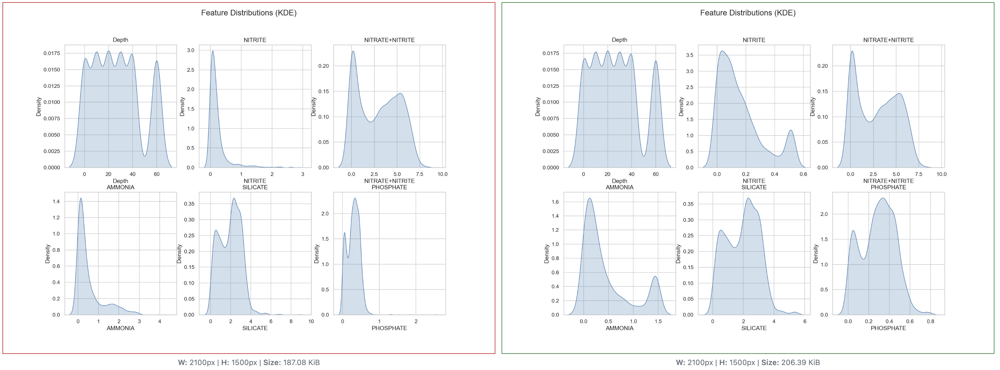
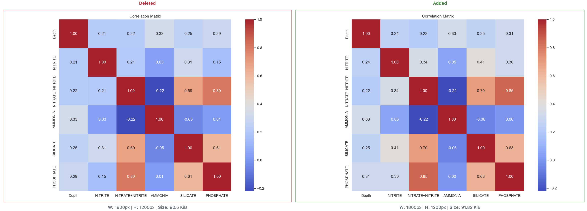
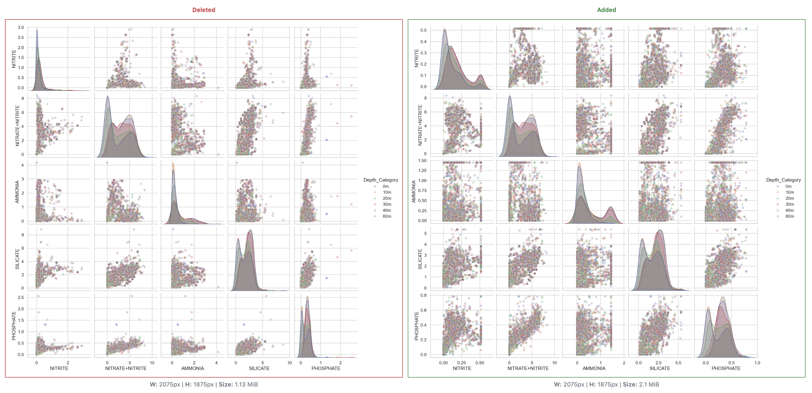

Cross-validation and tuning

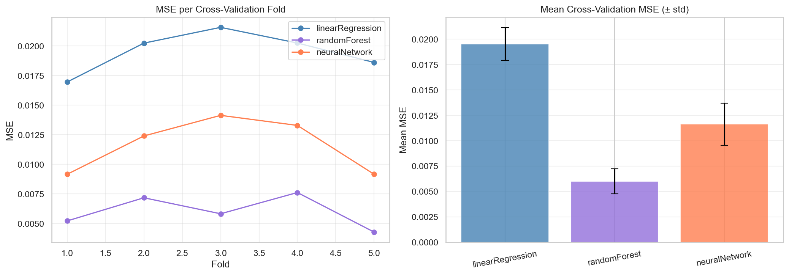
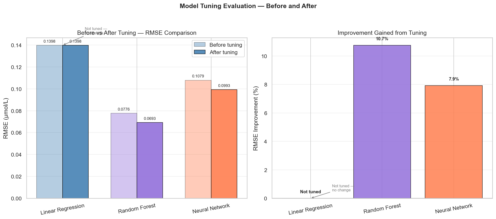

## Results (latest run)

R2 and RMSE from the latest run:

| Model | RMSE | R2 |
|---|---:|---:|
| Random Forest | 0.068330 | 0.783073 |
| Neural Network | 0.098541 | 0.548845 |
| Linear Regression | 0.132040 | 0.189969 |

Random Forest test screenshot:

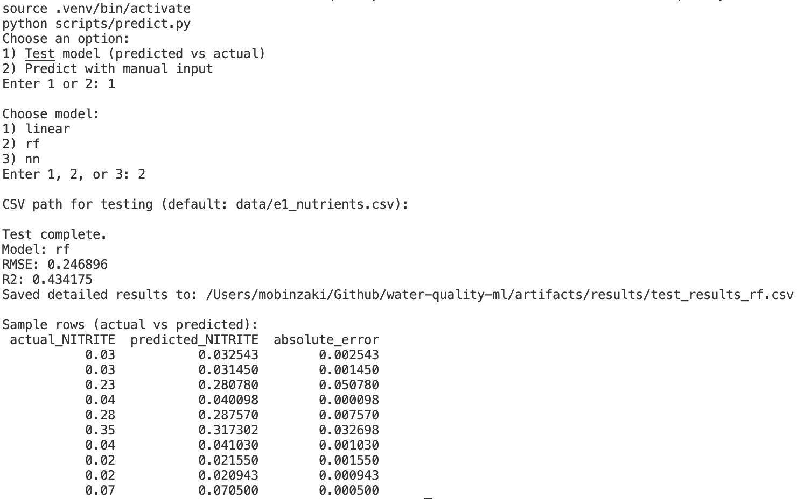

## Visual snapshot

Feature correlation heatmap

Model comparison chart (R2 and RMSE)

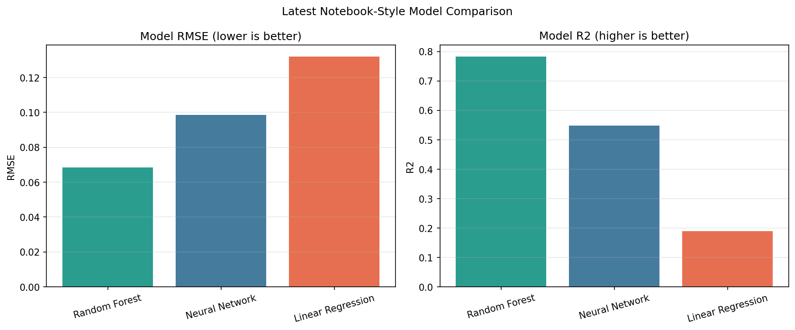

### Part 2: Optimisation benchmarking

- Objective: minimise the McCormick function.
- Methods:
	- Hill Climber (local search baseline)
	- Evolutionary Algorithm (population-based global search)
- Comparison focuses on convergence behaviour and solution quality.

#### Visual evidence for Part 2

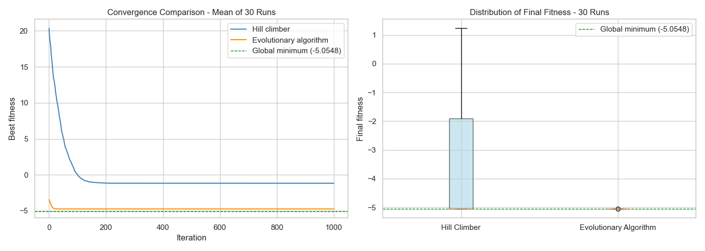

## Repository map

- `data/`: dataset used for modelling.
- `notebooks/main.ipynb`: full analysis and modelling workflow.
- `Analytics/1_raw_data_analytics/`: exploratory analysis outputs on raw data.
- `Analytics/2_After_capping/`: analysis outputs after outlier capping.
- `Analytics/3_cross_validator/`: validation-related artefacts.
- `Analytics/4_HC_vs_EA/`: optimisation experiment artefacts.

## Reproducible model artefacts and inference

Generate model artefacts and preprocessing metadata from scratch:

~~~bash
source .venv/bin/activate
python scripts/train_and_export_models.py
~~~

Run the interactive prediction menu:

~~~bash
source .venv/bin/activate
python scripts/predict.py
~~~

Use the old batch-style command if you want predictions from a CSV file:

~~~bash
source .venv/bin/activate
python scripts/predict.py --model rf --input data/e1_nutrients.csv --output artifacts/results/predictions_rf.csv
~~~

Generation script:

- `scripts/train_and_export_models.py`

This training run creates:

- model files in `artifacts/models/`
- preprocessing metadata in `artifacts/models/preprocessing.json`
- latest metrics in `artifacts/results/`
- model comparison snapshot in `Analytics/3_cross_validator/model_comparison_chart.png`

Trained model artefacts are saved in `artifacts/models/`:

- `linear_regression.pkl`
- `random_forest_tuned.pkl`
- `neural_network_tuned.pkl`
- `minmax_scaler.pkl`
- `preprocessing.json`

Latest run results are saved in `artifacts/results/`:

- `latest_model_results.csv`
- `latest_model_results.json`

Inference script:

- `scripts/predict.py`

Interactive mode lets you choose either model testing or manual prediction.

Batch mode expects a CSV with these feature columns: `Depth`, `NITRATE+NITRITE`, `AMMONIA`, `SILICATE`, `PHOSPHATE`.

## How to present this in interviews

- Start with the business framing: predicting water quality indicators from difficult, low-signal data.
- Explain one hard problem clearly: weak linear correlation with NITRITE and heavy outlier presence.
- Show your decision logic: why non-linear models and robust preprocessing were necessary.
- Highlight credibility practices: cross-validation, controlled preprocessing, and side-by-side model comparison.
- Finish with optimisation work to show breadth beyond standard supervised learning.

## Limitations and future work

- Dataset size is limited, which can constrain generalisation, especially for the neural network.
- Data comes from a specific sampling context, so transferability to new regions/seasons may require recalibration.
- Current workflow is notebook-first; moving to a packaged training pipeline and automated tests would improve maintainability.
- Future work: evaluate gradient-boosted models, add uncertainty intervals, and validate on an external holdout dataset.

## Run locally

1. Create and activate a virtual environment.

This project uses `.venv` so VS Code and Pylance resolve packages from the same interpreter.

Run this in terminal within the project directory.

<strong>Unix/macOS</strong>

~~~bash
python3 -m venv .venv
source .venv/bin/activate
python3 -m pip install --upgrade pip
python3 -m pip install -r requirements.txt
~~~

<strong>Windows (PowerShell)</strong>

~~~powershell
py -3 -m venv .venv
.venv\Scripts\Activate.ps1
py -3 -m pip install --upgrade pip
py -3 -m pip install -r requirements.txt
~~~

## Debug issues with installation of dependencies

To confirm the virtual environment is activated, check the location of your Python interpreter:

<strong>Unix/macOS</strong>

~~~bash
which python

# Example output:
# /Users/user/Github/water-quality-ml/.venv/bin/python
~~~

<strong>Windows (PowerShell)</strong>

~~~powershell
Get-Command python

# Example output:
# CommandType     Name      Version    Source
# -----------     ----      -------    ------
# Application     python.exe 3.x.x.x  C:\Users\user\Github\water-quality-ml\.venv\Scripts\python.exe
~~~

Check if pip is installed:

<strong>Unix/macOS</strong>

~~~bash
python3 -m pip --version

# Example output:
# pip 26.0.1 from /Users/user/Github/water-quality-ml/.venv/lib/python3.14/site-packages/pip (python 3.14)
~~~

<strong>Windows (PowerShell)</strong>

~~~powershell
py -3 -m pip --version

# Example output:
# pip 26.0.1 from C:\Users\user\Github\water-quality-ml\.venv\Lib\site-packages\pip (python 3.14)
~~~

## VS Code setup

If `Import "pandas" could not be resolved from source` appears, select the workspace interpreter:

- Command Palette -> `Python: Select Interpreter`
- Choose `.venv` in this project

## Run Jupyter Notebook

After activating the virtual environment, run one of the following commands from the project root.

<strong>Unix/macOS</strong>

~~~bash
# Open in classic Notebook UI
jupyter notebook notebooks/main.ipynb

# Or open in JupyterLab
jupyter lab notebooks/main.ipynb
~~~

<strong>Windows (PowerShell)</strong>

~~~powershell
# Open in classic Notebook UI
py -3 -m notebook notebooks/main.ipynb

# Or open in JupyterLab
py -3 -m jupyter lab notebooks/main.ipynb
~~~

## Badges

